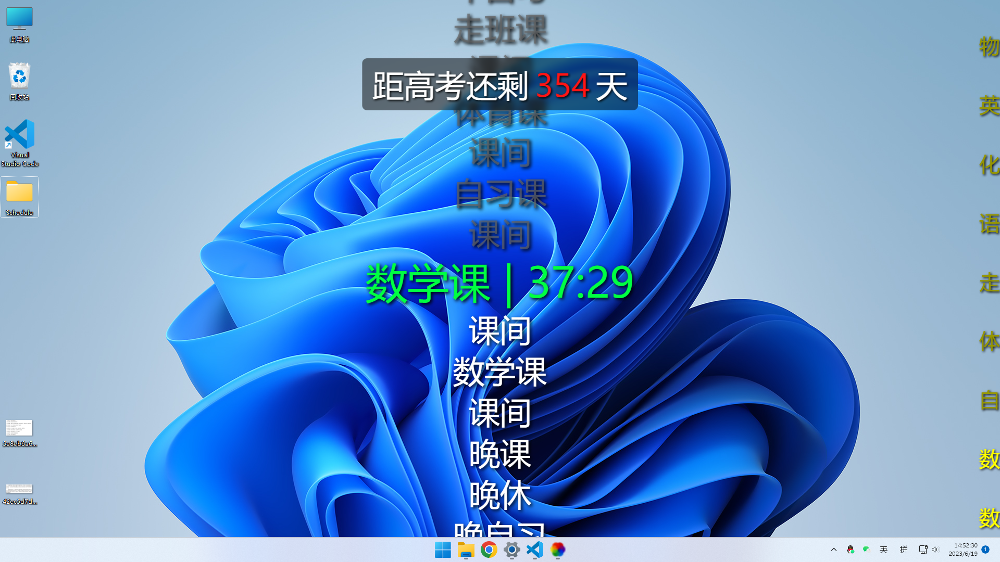

# 实时课表 - 动态桌面壁纸(Vue3)
- 一个用于学校电子白板桌面动态壁纸的项目
- 使用vite+vue3制作
- 可以根据系统时间动态显示当前课程及时间段内容
- 有丝滑的过渡动画
- 屏幕上方显示高考剩余天数
- 课表内容，文字颜色，动画过渡，高考时间等均可在代码上方的常量部分配置
- 可以使用动态壁纸软件挂载到系统桌面壁纸层面上，如Wallpaper Engine，Lively Wallpaper 等
- 纯小白，欢迎大家对本项目纠错与改进

# 食用方法
1. 克隆代码或直接下载ZIP解压
2. 在 `src/App.vue` 中更改你的课表及相关配置
3. 根目录命令行运行 `npm install` 
4. 根目录命令行运行 `npm run dev` 根据命令行提示在浏览器中预览
5. 根目录命令行运行 `npm run build` 构建打包
6. 在生成的dist文件夹中将 `index.html` 中路径`/xxx`改为`./xxx`以便壁纸软件识别
7. 复制dist中的所有文件导入动态壁纸软件，入口：`index.html`